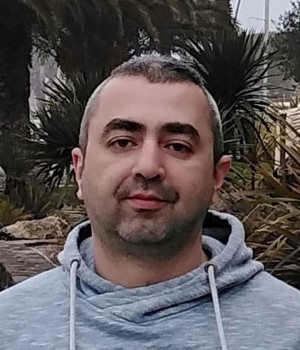
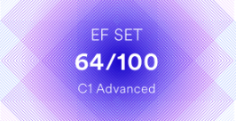

## [rsschool-cv](https://alextufeng.github.io/rsschool-cv/cv)

# Alexander Tiufiakov
***js/fe junior***



---

## Contact me


Cell.: +375445770033  
Email: salman-aka@mail.ru  
Discord: [Alexander Tiufyakov#0762](https://discordapp.com/users/673453451711217685/)    
GitHub:  [Alextufeng](https://github.com/Alextufeng)  
Telegram: [AlexTufeng](https://t.me/AlexTufeng)

---
## About me  


My name is Alexander. Now I am working as a tattoo master. And today my main goal is to start a career at front-end. I had a little experience with setting up a websites and I strive to improve this skills. I have good analytical mindset, assiduity and purposefulness. Besides I do not have any difficulties with my communication skills and I also think teamwork will not be a problem.  

---  

## Education  


- 2009  
	**Belarusian National Technical University**  
	*engineer-manager at transport logistics*

- 2020  
	**IT-step**  
	*Basics at front-end (HTML, CSS, JS)*  

---  

## Experience  


+ *online training*
+ *online books*
+ *webinars*
+ *offline course of FE-development [^1]*
+ *JS/FE Pre-School 2022!* 

[^1]: I have not finished all the course of FE at IT-Step because of business trip to Europe at that moment. So I have no certificate.

---  

## Skills  


+ *HTML/CSS*  
+ *JavaScript (entry level)*  
+ *Python(entry level)*  
+ *Adobe Photoshop*
+ *Figma*

---

## Code example (JS):  
**Data Reverse (Codewars' Kata)**

```
function dataReverse(data) {
  let array = [];
  for (let i =0; i<data.length; i+=8){
   array.unshift(data.slice(i, i+8));
  }
 return [].concat(...array);
}
```

---

## My Projects

My projects from JS/FE Pre-School:
+ [Portfolio](https://rolling-scopes-school.github.io/alextufeng-JSFEPRESCHOOL/portfolio/)
+ [Photo Gallery](https://rolling-scopes-school.github.io/alextufeng-JSFEPRESCHOOL/js30task2part2)
+ [Memory Game](https://rolling-scopes-school.github.io/alextufeng-JSFEPRESCHOOL/js30task3part2)

---

## English  

**Upper Intermediate/Advanced (B2/C1)** according to the test by [](https://www.efset.org/)

[](https://www.efset.org/cert/jhMRU8)  